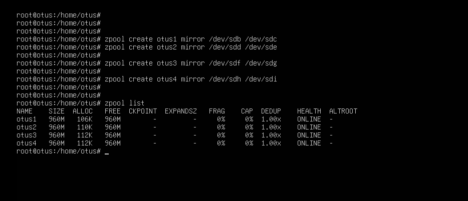
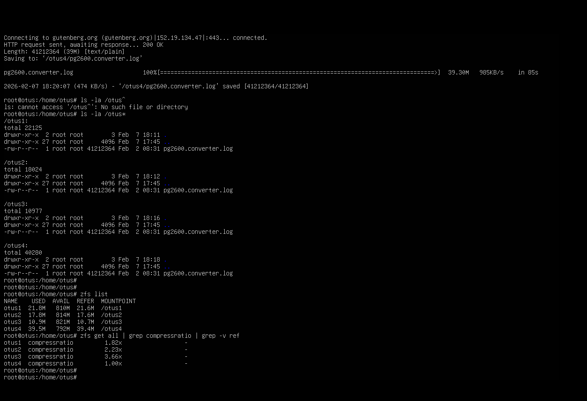
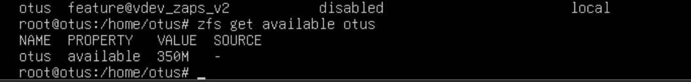
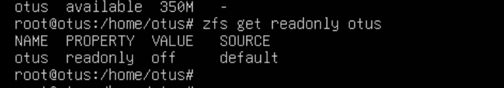
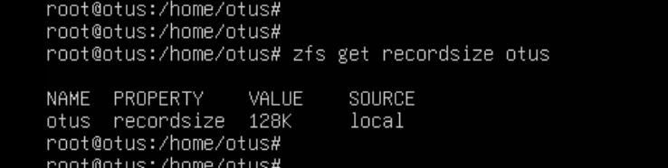
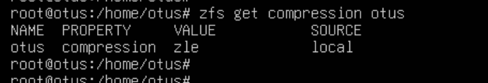
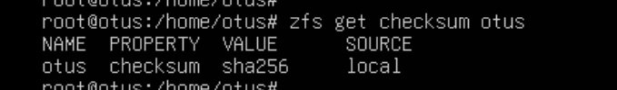
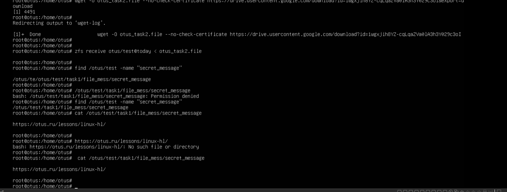

Определить алгоритм с наилучшим сжатием:
    определить, какие алгоритмы сжатия поддерживает zfs (gzip, zle, lzjb, lz4);
    создать 4 файловых системы, на каждой применить свой алгоритм сжатия;
    для сжатия использовать либо текстовый файл, либо группу файлов.

Определить настройки пула.
С помощью команды zfs import собрать pool ZFS.
Командами zfs определить настройки:
    размер хранилища;
    тип pool;
    значение recordsize;
    какое сжатие используется;
    какая контрольная сумма используется.
Работа со снапшотами:
    скопировать файл из удаленной директории;
    восстановить файл локально. zfs receive;
    найти зашифрованное сообщение в файле secret_message.   

Содаем пулы из дисков

Проверяем самый эффективный алгоритм сжатия

Размер пула

Тип пула

Значение recordsize

Тип сжатия

Тип контрольной суммы

Работа со снепшотом
