## Задание 3
Создание PV, VG, LV

Создание файловой системы и монтирование

Копирование root

Обновление загрузчика

Создание нового LV

Файловая система

Копирование root

Обновление загрузчика grub

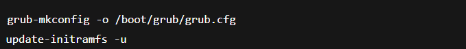

Удаление старого root и переименование

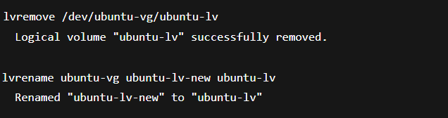

Выделение /var в mirror cоздание PV и VG

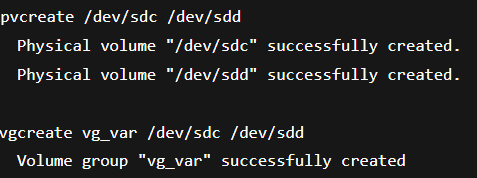

Создание mirror LV

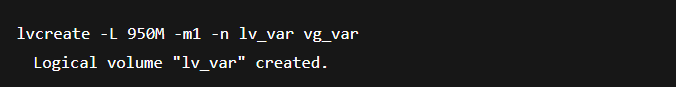

Файловая система

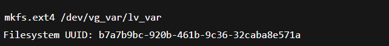

Перенос /var и fstab

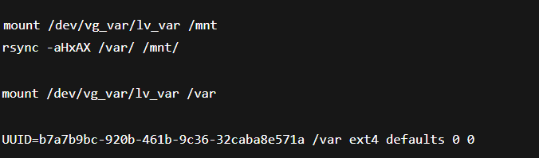

Выделение /home в отдельный том и создание LV

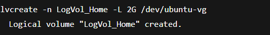

Файловая система

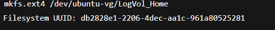

Перенос /home и fstab

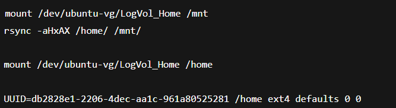

СНЭПШОТЫ

Генерация файлов и созд снепшота (touch /home/file{1..20})

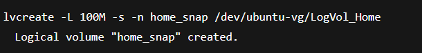

далее удаляем файлы (rm -f /home/file{1..20})
 и воостанавливаемся из снепшота

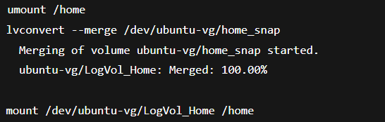