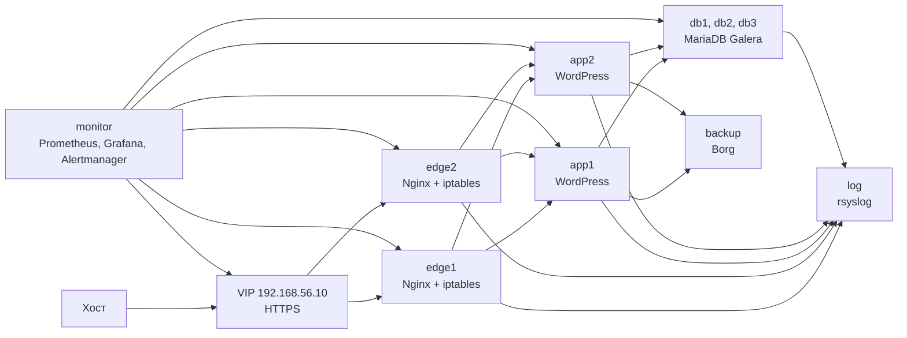

## Отказоустойчивое развертывание защищенного веб-сервиса

Итоговый стенд разворачивает WordPress в DMZ и закрывает требования по HTTPS, входному firewall, наблюдаемости, централизованным логам и резервному копированию.

### Схема



### Что настроено

- `edge1` и `edge2` держат виртуальный IP через Keepalived. На входе разрешены только HTTPS, SSH из служебных сетей, VRRP и сбор метрик.
- Nginx на edge завершает TLS и распределяет запросы между `app1` и `app2`.
- Каждый application-узел запускает WordPress, а локальный HAProxy выбирает живой узел MariaDB Galera.
- `db1`, `db2` и `db3` образуют кластер MariaDB Galera. При отключении одного узла кворум сохраняется.
- `log` принимает системные и Nginx-логи по TCP 514. На клиентах включена дисковая очередь rsyslog.
- `backup` хранит зашифрованные Borg-репозитории. Таймер на каждом application-узле сохраняет файлы WordPress, конфигурацию Nginx и дамп базы.
- `monitor` запускает Prometheus, Alertmanager, Blackbox exporter и Grafana. Создан дашборд с CPU, памятью, диском и сетью.

### Запуск

```bash
vagrant up
```

Provisioning запускается после старта всех ВМ и выполняется Ansible с узла `monitor`.

Для обращения к сайту с хоста:

```bash
curl -k --resolve web.local:443:192.168.56.10 https://web.local/
```

Grafana: `http://192.168.56.50:3000`, пользователь `admin`, пароль `OtusGrafana-2026`.

Prometheus: `http://192.168.56.50:9090`.

### Проверка стенда

Проверка выполнена 24.08.2026 после полного `vagrant up` и Ansible provisioning.

- все десять ВМ находятся в состоянии `running`;
- `https://web.local` через `192.168.56.10` возвращает `HTTP 200` и страницу `OTUS Final Project`;
- при остановке `edge1` виртуальный IP переходит на `edge2`, сайт остаётся доступен по тому же адресу;
- `wsrep_cluster_size` равен `3`, статус Galera — `Primary`;
- Prometheus видит 11 целей: 10 node exporter и HTTPS probe;
- тестовый лог с `app1` получен на `log`;
- создан Borg-архив `app1-2026-08-24T13:38:49`, репозиторий подтверждён как `Encrypted: Yes`.

### Telegram-алерты

До добавления реквизитов Alertmanager использует приёмник `discard`: правила и проверки уже работают, но сообщения не отправляются.

Для включения Telegram создаётся файл `ansible/group_vars/all/secrets.yml`:

```yaml
telegram_enabled: true
telegram_bot_token: "токен_бота"
telegram_chat_id: "идентификатор_чата"
```

Файл исключён из Git. После добавления реквизитов достаточно применить конфигурацию повторно:

```bash
vagrant provision monitor
```

### Проверка

```bash
vagrant ssh edge1 -c 'curl -k https://192.168.56.10/'
vagrant ssh db1 -c "sudo mariadb -NBe \"SHOW STATUS LIKE 'wsrep_cluster_size'\""
vagrant ssh app1 -c 'systemctl list-timers wordpress-backup.timer'
vagrant ssh backup -c 'sudo -u borg borg list /var/backup/borg/app1'
vagrant ssh log -c 'sudo find /var/log/remote -type f'
```

Подробное описание компонентов, порядок запуска и поведение при отказах находятся в [docs/defense.md](docs/defense.md). Связь с навыками из всех домашних заданий собрана в [docs/skills.md](docs/skills.md).

### Файлы

- `Vagrantfile` — десять ВМ и сети стенда;
- `ansible/playbook.yml` — порядок развёртывания;
- `ansible/roles` — настройка инфраструктурных компонентов;
- `ansible/group_vars/all/main.yml` — адреса и параметры стенда без Telegram-секретов;
- `docs/defense.md` — материал для защиты.
