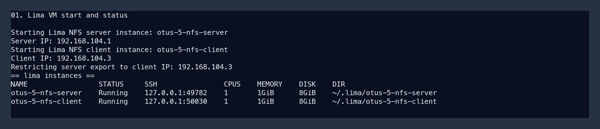
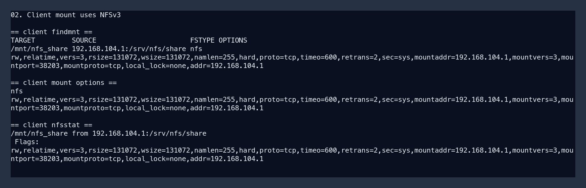
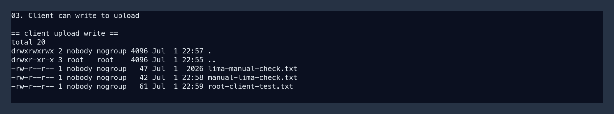
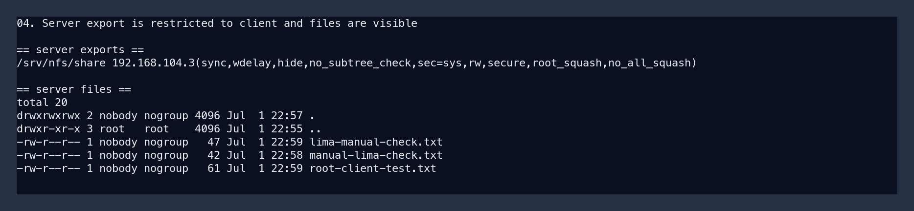
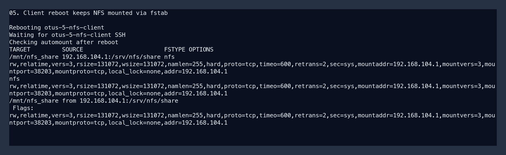

# Работа с NFS

Стенд поднимает две виртуальные машины:

- `nfs_server` — сервер NFS, IP `192.168.56.10`;
- `nfs_client` — клиент NFS, IP `192.168.56.11`.

Автоматизация сделана через `Vagrantfile` и shell provisioning scripts.

## Файлы

- `Vagrantfile` — описание двух VM и private network.
- `scripts/provision-nfs-server.sh` — установка `nfs-kernel-server`, создание export `/srv/nfs/share` и каталога `upload`.
- `scripts/provision-nfs-client.sh` — установка `nfs-common`, настройка `/etc/fstab` и монтирование export через NFSv3.
- `scripts/check-nfs.sh` — проверка mount, версии NFS и записи в `upload`.

## Запуск

```bash
vagrant up
```

Если нужно повторно применить настройки:

```bash
vagrant provision
```

## Что настроено на сервере

На сервере создана директория:

```bash
/srv/nfs/share
```

Внутри нее создан каталог для записи:

```bash
/srv/nfs/share/upload
```

Export ограничен IP клиента:

```bash
/srv/nfs/share 192.168.56.11(rw,sync,no_subtree_check,root_squash)
```

Проверка на сервере:

```bash
vagrant ssh nfs_server
sudo exportfs -v
cat /proc/fs/nfsd/versions
sudo ls -la /srv/nfs/share/upload
```

## Что настроено на клиенте

На клиенте создана точка монтирования:

```bash
/mnt/nfs_share
```

В `/etc/fstab` добавлена запись с NFSv3:

```bash
192.168.56.10:/srv/nfs/share /mnt/nfs_share nfs nfsvers=3,proto=tcp,_netdev,nofail,x-systemd.requires=network-online.target,x-systemd.after=network-online.target 0 0
```

Проверка на клиенте:

```bash
vagrant ssh nfs_client
findmnt /mnt/nfs_share
findmnt -no FSTYPE,OPTIONS /mnt/nfs_share
nfsstat -m
echo "check from client" | sudo tee /mnt/nfs_share/upload/check.txt
ls -la /mnt/nfs_share/upload
```

В выводе `findmnt` или `nfsstat -m` должен быть параметр:

```bash
vers=3
```

## Общая проверка

```bash
./scripts/check-nfs.sh
```

Проверка автомонтирования после перезагрузки клиента:

```bash
vagrant reload nfs_client
vagrant ssh nfs_client -c 'findmnt /mnt/nfs_share && findmnt -no FSTYPE,OPTIONS /mnt/nfs_share && nfsstat -m'
```

## Скриншоты

Скриншоты ниже показывают проверку основных требований: две VM, NFSv3 mount на клиенте, запись в `upload`, export на сервере и автомонтирование после перезагрузки клиента.











## Откат

```bash
vagrant destroy -f
```
