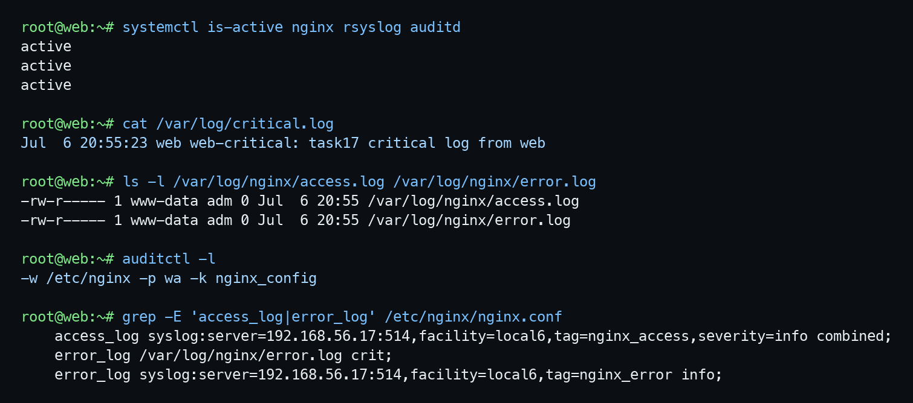
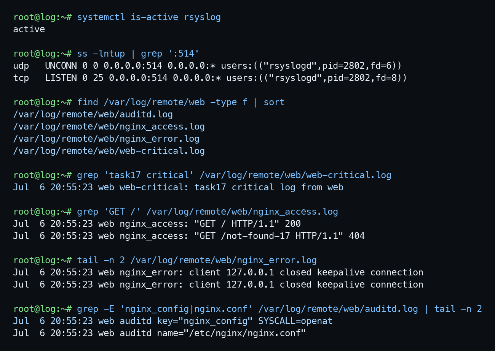

## Задание 17. Logging

### Репозиторий

https://github.com/ashermahonin/otus-linux-professional/tree/17-logging

### Задание

Поднять две машины: `web` и `log`.

На `web` запустить `nginx`.

На `log` настроить центральный лог-сервер.

Настроить аудит изменений конфигурации `nginx`.

Критичные логи с `web` должны писаться локально и уходить на `log`.

Логи `nginx` должны уходить на `log`. Локально остаются только критичные события.

Логи аудита тоже должны уходить на `log`.

### Что сделано

На `web` запущены `nginx`, `rsyslog`, `auditd`.

На `log` запущен `rsyslog`, прием логов открыт на порту `514`.

Для критичных сообщений на `web` настроена локальная запись в `/var/log/critical.log` и отправка на `log`.

Для `nginx` настроена отправка access/error логов на `log`. Локальные файлы `/var/log/nginx/access.log` и `/var/log/nginx/error.log` после обычных запросов остаются пустыми.

Для аудита включено правило:

```text
-w /etc/nginx -p wa -k nginx_config
```

После изменения `/etc/nginx/nginx.conf` событие с ключом `nginx_config` появилось на удаленном сервере.

### Скриншот web

На скриншоте видно:

- сервисы `nginx`, `rsyslog`, `auditd` активны;
- критичный лог есть локально;
- локальные nginx access/error файлы пустые;
- audit rule на `/etc/nginx` включен;
- nginx пишет access/error в syslog на `log`.



### Скриншот log

На скриншоте видно:

- `rsyslog` слушает порт `514`;
- на `log` есть удаленные файлы с `web`;
- критичный лог пришел на `log`;
- nginx access/error пришли на `log`;
- audit-событие изменения `/etc/nginx/nginx.conf` пришло на `log`.


